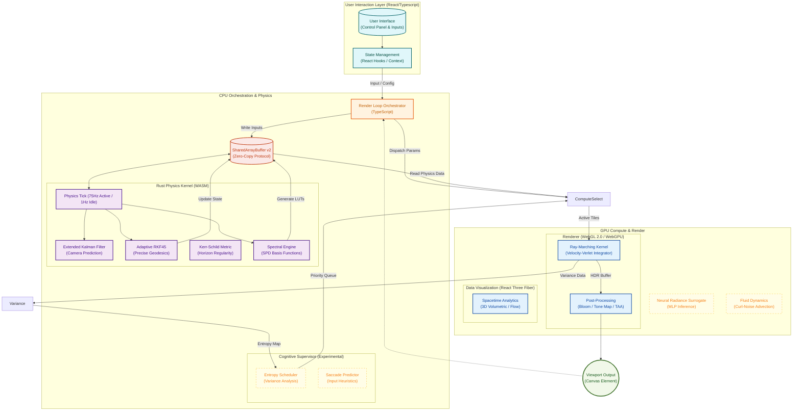

# System Architecture & Engineering Specifications

This document outlines the high-performance rendering pipeline, mathematical foundations, and software architecture of the relativistic black hole simulation. It reflects the **Hybrid Rust/WebGL 2.0 Architecture** and the project's long-term roadmap for predictive rendering.

---

## 1. Execution Pipeline

The rendering engine operates on a **Zero-Copy Reactive Data Pipeline**, utilizing a strict separation of concerns between high-level orchestration (TypeScript), the physics kernel (Rust/WASM), and the massively parallel rendering engine (WebGL 2.0 / WebGPU Alpha).

The system employs a **Hybrid Integrator Strategy**: High-precision adaptive math in the Rust kernel and high-throughput symplectic integration on the GPU.



---

## 2. Project File Structure Analysis

The project is organized into strictly defined modules to separate concerns between the React application lifecycle, the CPU-side physics engine (Rust), and the GPU-side shader programs.

```text
src/
├── app/                                  # Next.js App Router (Entry Points)
├── components/                           # UI & Rendering Components
├── configs/                              # Static Configuration
├── engine/                               # WASM Integration
├── hooks/                                # Logic & State Management
├── rendering/                            # Rendering Orchestration
├── shaders/                              # GLSL & WGSL Programs
├── workers/                              # Off-Main-Thread Computation
└── ...

physics-engine/                           # Rust Physics Kernel
├── gravitas-core/                        # Core Math Library
└── gravitas-wasm/                        # WASM FFI Layer
```

---

## 3. Architecture Logic Levels

The system employs a multi-tiered architecture to balance precision, performance, and flexibility.

### 3.1. Level 1: Orchestration (TypeScript)

**Responsibility**: Input handling, UI state, and the main Event Loop.

- **Role**: Conductor. It does not perform heavy math.
- **Data**: Reads user input, writes to the **SharedArrayBuffer (SAB)**, and dispatches GPU commands.

### 3.2. Level 2: Physics Kernel (Rust/WASM)

**Responsibility**: High-precision relativistic calculations and state stability.

- **Role**: The Brain. Runs at a variable high-frequency tick (75Hz Active / 1Hz Idle).
- **Core Modules**:
  - **`kerr`**: Solves exact physics invariants using `f64`. Implements **Kerr-Schild coordinates** to ensure the metric remains regular at the event horizon.
  - **`geodesic` / `integrator`**: Integrates ray paths using an **Adaptive RKF45** method for scientific ground truth.
  - **`spectrum`**: Generates LUTs for Doppler-shifted blackbody radiation.
  - **`camera`**: Uses an **Extended Kalman Filter (EKF)** to predict camera movement and eliminate latency.

### 3.3. Level 3: Compute & Render (WebGL 2.0 / WebGPU)

**Responsibility**: Massively parallel ray tracing and cinematic visualization.

- **Role**: The Muscle. Executes billions of ray steps per frame.
- **Key Implementation**:
  - **WebGL 2.0 Shaders (Current)**: Primary production engine. Uses **Regularized Kerr-Schild Acceleration** with a **Velocity-Verlet** integrator.
  - **WebGPU (Alpha)**: Strategic transition layer for subgroup-level optimizations and compute-based denoising.
  - **React Three Fiber**: Handles light-weight data visualization overlays (grids, vectors).

### 3.4. Level 4: Cognitive Supervisor (Heuristics)

**Responsibility**: Intelligent workload allocation and prediction.

- **Role**: The Tactician. Optimizes _where_ and _when_ to render.
- **Modules**:
  - **Entropy Scheduler**: **[ROADMAP]**. Analyzes frame variance to direct compute shaders to "interesting" regions.
  - **Saccade Predictor**: **[ROADMAP]**. Detects rapid eye/camera movements and temporarily reduces resolution.

---

## 4. Zero-Copy Communication Protocol (SAB)

To eliminate Garbage Collection (GC) pauses, the system uses a rigid binary protocol over a `SharedArrayBuffer` shared between JS, Rust, and (via mapping) the GPU.

| Offset  | Section       | Size     | Content                                                |
| :------ | :------------ | :------- | :----------------------------------------------------- |
| `0x000` | **Control**   | 64B      | Mutex locks, Frame Counters, Ready Flags (Atomics).    |
| `0x040` | **Camera**    | 64B      | Position, Quaternion, Velocity Vectors (EKF State).    |
| `0x080` | **Physics**   | 128B     | Mass, Spin, $r_{horizon}$, $r_{isco}$, $T_{disk}$.     |
| `0x100` | **Telemetry** | 256B     | FPS, Frame Time, GPU Disjoint Timer values.            |
| `0x800` | **LUTs**      | Variable | Spectral Intensity Tables, Accretion Density Profiles. |

---

## 5. Mathematical Framework (Advanced)

### 5.1. Symplectic Integration

Geometric optics are validated using an **Adaptive Runge-Kutta-Fehlberg 4(5)** integrator, which conserves the Hamiltonian energy $H = \frac{1}{2} g^{\mu\nu} p_\mu p_\nu = 0$ by adjusting step sizes to maintain local error bounds.

### 5.2. Radiative Transfer

The engine solves the **Radiative Transfer Equation (RTE)** along the ray path:
$$ \frac{dI*\nu}{d\lambda} = -\alpha*\nu I*\nu + j*\nu $$
This allows for volumetric effects like self-shadowing and realistic limb darkening.

---

## 6. Performance Logic

### 6.1. OffscreenCanvas Implementation

- **Purpose**: Future roadmap for Tier 3.
- **Worker Management**: See `src/engine/worker-pool.ts` (WIP).
- **Fallback Logic**: Standard WebGL 2.0 rendering if `SharedArrayBuffer` is unsupported.

### 6.2. Predictive Latency Compensation

The Rust kernel uses an **Extended Kalman Filter (EKF)** to predict the camera's position at the exact moment of V-Sync, eliminating input lag.
